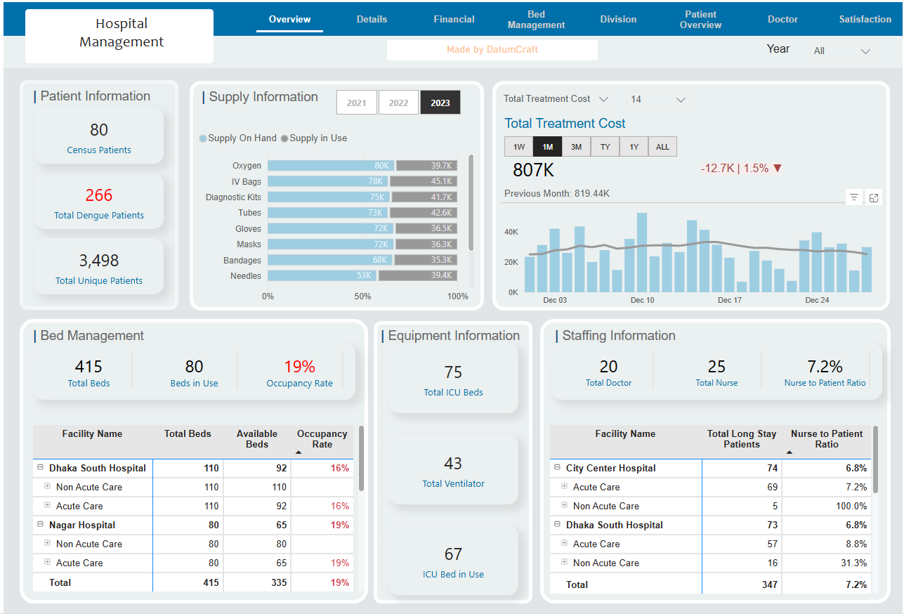
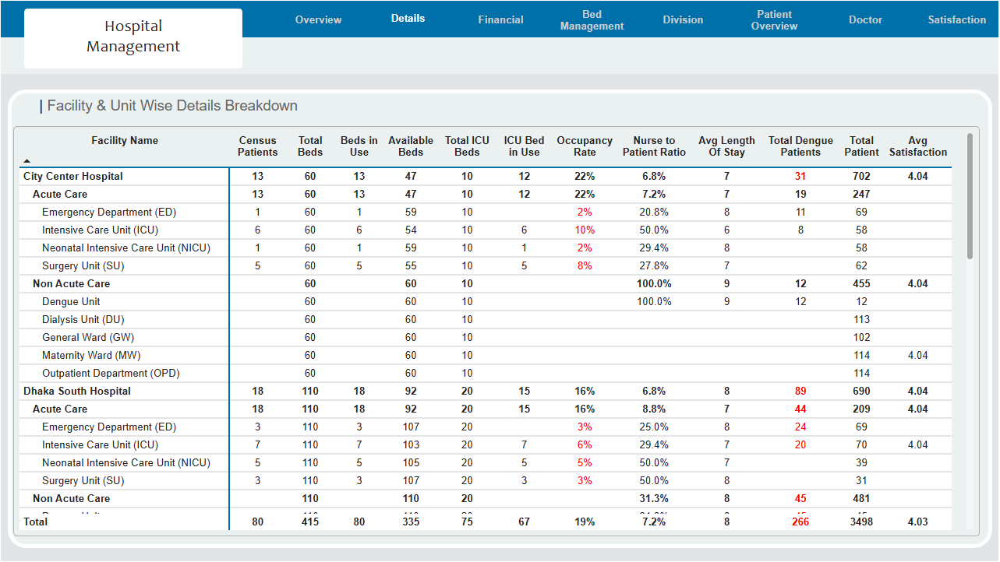
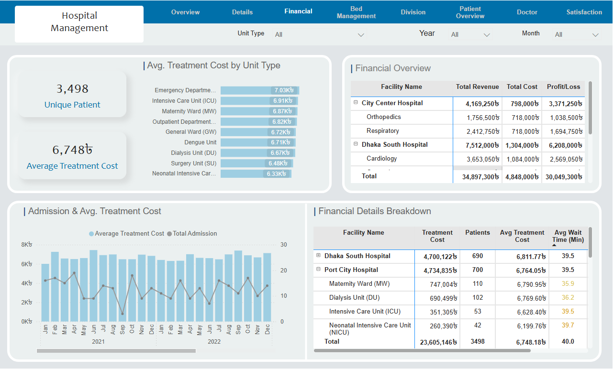
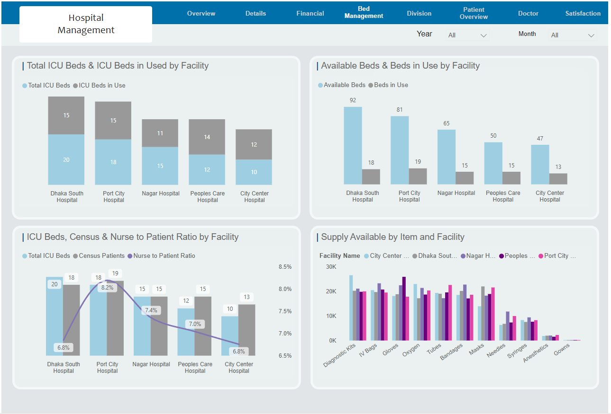
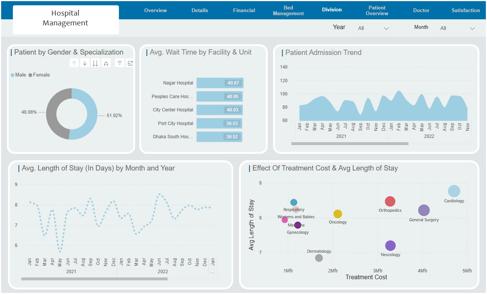
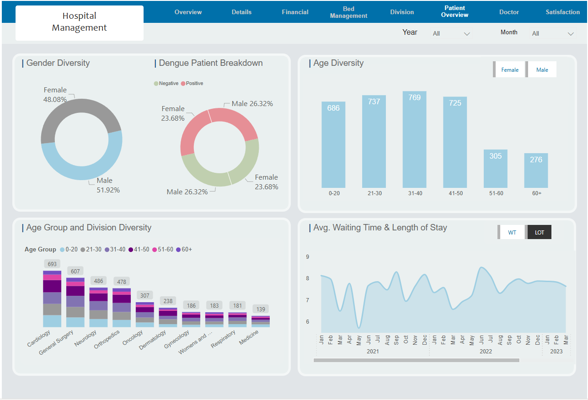
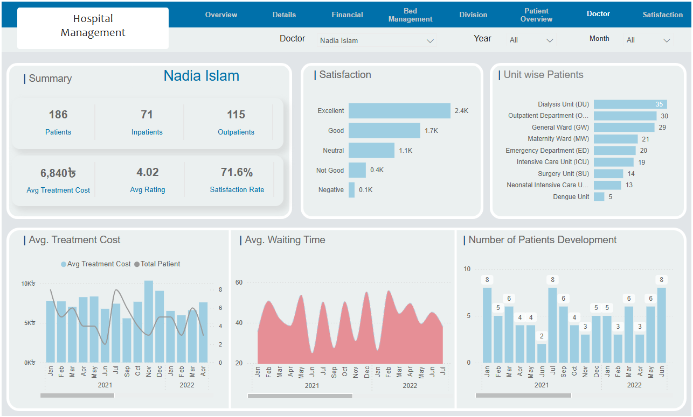
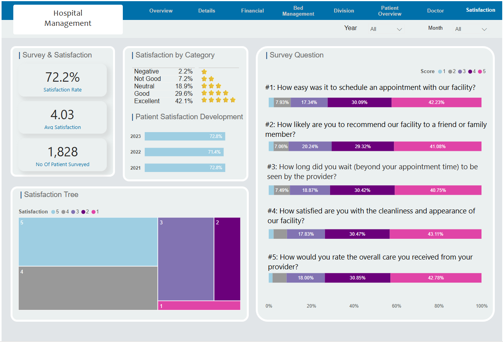

# 🏥 Hospital Management Dashboard — Power BI

> An 8-page **Power BI** dashboard built for a multi-facility hospital network — covering patient flow, bed management, financials, staffing, doctor performance, and patient satisfaction in a single connected report.

🔗 **[View Live Dashboard →](https://app.powerbi.com/view?r=eyJrIjoiZDA3ODI2ZjctMDk4OC00Yjc5LWJjYTUtMjM5Y2M3N2MxZGU5IiwidCI6IjdjMjY3ZTkyLWExM2ItNGU1NS05YTc3LTFlZjg2NzE1OTU4NSIsImMiOjEwfQ%3D%3D)**

---

## 📌 Project Overview

Hospital management teams typically work across disconnected systems — bed occupancy in one place, financials in another, patient satisfaction somewhere else entirely. There's no single view that connects operational data to clinical and financial outcomes.

I built a comprehensive Power BI dashboard suite for a 5-facility hospital network in Bangladesh, consolidating patient data, bed and supply management, treatment financials, doctor-level performance, and patient satisfaction surveys into one interactive report — filterable by year, month, facility, unit type, and doctor.

**Facilities covered:** City Center Hospital · Dhaka South Hospital · Nagar Hospital · Peoples Care Hospital · Port City Hospital
**Tool:** Power BI
**Pages:** 8 (Overview, Details, Financial, Bed Management, Division, Patient Overview, Doctor, Satisfaction)

---

## 📄 Dashboard Pages

### 1. Overview — Executive Summary

The entry point of the report. Gives leadership a full hospital network snapshot at a glance — patients, supply levels, bed occupancy, equipment, staffing ratios, and total treatment cost trend in one view.



**Key metrics visible:**
- **80** census patients · **266** dengue patients · **3,498** total unique patients
- **415** total beds · **80** beds in use · **19%** occupancy rate
- **75** total ICU beds · **67** ICU beds in use · **43** ventilators
- **20** doctors · **25** nurses · **7.2%** nurse-to-patient ratio
- Total treatment cost (1M view): **807K৳** — down 1.5% vs previous month
- Supply overview: Oxygen, IV Bags, Diagnostic Kits, Gloves, Tubes, Masks, Bandages, Needles

---

### 2. Details — Facility & Unit Breakdown Table

A full drill-down table showing every facility, unit type (Acute Care, Non-Acute Care), and sub-unit (ED, ICU, NICU, Surgery, General Ward, etc.) with all key metrics in one scrollable view.



**Columns included:**
Census Patients · Total Beds · Beds in Use · Available Beds · Total ICU Beds · ICU Beds in Use · Occupancy Rate · Nurse to Patient Ratio · Avg Length of Stay · Total Dengue Patients · Total Patients · Avg Satisfaction

**Key totals:**
- Network total: **3,498** patients across **415** beds at **19%** occupancy
- **266** dengue patients flagged in red across facilities
- Avg satisfaction: **4.03** across all facilities

---

### 3. Financial — Revenue, Cost & Profitability

Tracks treatment revenue, costs, and profit/loss by facility and specialisation. Includes average treatment cost by unit type and a time-series view of admissions vs cost.



**Key metrics visible:**
- **3,498** unique patients · avg treatment cost: **6,748৳**
- Total network revenue: **34,897,300৳** · Total cost: **4,848,000৳** · Net profit: **30,049,300৳**
- Highest avg cost unit: Emergency Department at **7.03K৳**
- Financial breakdown by facility and specialisation (Cardiology, Orthopedics, Respiratory, etc.)
- Monthly admission vs average treatment cost chart (2021–2022)

---

### 4. Bed Management — ICU & Ward Capacity

A dedicated operational view for bed managers. Shows total vs in-use ICU beds, available vs occupied ward beds, nurse-to-patient ratios, and medical supply levels — all by facility.



**Key metrics visible:**
- ICU beds by facility: Dhaka South (20 total / 15 in use) · Port City (18/15) · Nagar (15/11) · Peoples Care (12/14) · City Center (10/12)
- Available beds: Dhaka South 92 · Port City 81 · Nagar 65 · Peoples Care 50 · City Center 47
- Nurse-to-patient ratio peaks at Port City Hospital (8.2%)
- Supply stock levels across 11 item types (Diagnostic Kits, IV Bags, Gloves, Oxygen, Tubes, Bandages, Masks, Needles, Syringes, Anaesthetics, Gowns)

---

### 5. Division — Clinical Operations & Wait Times

Breaks down patients by gender and medical specialisation, tracks average wait times by facility, and plots the relationship between treatment cost and average length of stay across specialisations.



**Key metrics visible:**
- Gender split: **51.92% male** · **48.08% female**
- Avg wait time: Nagar Hospital highest at **40.67 mins** · Dhaka South lowest at **39.52 mins**
- Patient admission trend: 2021–2022 monthly volume ranging 60–120 admissions
- Avg length of stay: 7–8 days consistently across the period
- Bubble chart: Cardiology has the highest treatment cost and longest stay; Dermatology is lowest

---

### 6. Patient Overview — Demographics & Disease Profile

Profiles the patient population by gender, age group, dengue status, and medical division. Includes a toggle between waiting time and length-of-stay trend lines.



**Key metrics visible:**
- Age distribution: 31–40 age group is largest (769 patients) · 60+ group smallest (276)
- Dengue breakdown: Male positive 26.32% · Female positive 23.68%
- Highest patient volumes by division: Cardiology (693) · General Surgery (607) · Neurology (486)
- Avg waiting time and length of stay tracked monthly across Jan 2021 – Mar 2023

---

### 7. Doctor — Individual Doctor Performance

A doctor-level view filterable by name, year, and month. Shows each doctor's patient load, satisfaction ratings, unit distribution, treatment costs, waiting times, and patient growth trends.



**Example shown — Dr. Nadia Islam:**
- **186** total patients (71 inpatients · 115 outpatients)
- Avg treatment cost: **6,840৳** · Avg rating: **4.02** · Satisfaction rate: **71.6%**
- Highest patient unit: Dialysis Unit (35) followed by OPD (30) and General Ward (29)
- Satisfaction breakdown: Excellent 2.4K · Good 1.7K · Neutral 1.1K

---

### 8. Satisfaction — Patient Feedback Analysis

A full patient satisfaction module built on survey data. Covers overall satisfaction rate, year-over-year trends, satisfaction by rating category, and individual survey question breakdowns.



**Key metrics visible:**
- Overall satisfaction rate: **72.2%** · Avg satisfaction score: **4.03**
- **1,828** patients surveyed
- Satisfaction by category: Excellent 42.1% · Good 29.6% · Neutral 18.9% · Not Good 7.2% · Negative 2.2%
- YoY trend: 2021 (72.8%) → 2022 (71.4%) → 2023 (72.8%)
- 5 survey questions scored: scheduling ease, recommendation likelihood, wait time, facility cleanliness, overall care quality

---

## 🛠️ How It Was Built

| Layer | Detail |
|---|---|
| **Tool** | Microsoft Power BI |
| **Data** | Multi-facility hospital dataset |
| **Pages** | 8 interconnected report pages |
| **Filters** | Year · Month · Facility · Unit Type · Doctor |
| **Visuals** | Bar charts, donut charts, line charts, bubble charts, treemaps, tables, KPI cards, stacked bar charts |
| **Features** | Cross-page filter sync · drill-down tables · togglable chart views (e.g. WT vs LOT) |

---

## 📁 Dashboard Structure

```
Hospital Management Dashboard/
├── Overview          # Executive summary — patients, supply, beds, staffing, cost
├── Details           # Full facility × unit breakdown table
├── Financial         # Revenue, cost, profit by facility and specialisation
├── Bed Management    # ICU capacity, ward availability, supply stock
├── Division          # Wait times, admission trends, treatment cost vs LOS
├── Patient Overview  # Demographics, age groups, dengue, division profile
├── Doctor            # Individual doctor KPIs, filterable by name
└── Satisfaction      # Survey analysis, scores, YoY trends
```

---

## 👤 About

Built by **[Md Arshad Ahammed (Ash)](https://arshadadvisory.com)** — Marketing Performance Analyst specialising in Power BI, SQL, Looker Studio, GA4, and healthcare analytics.

📬 [arshadadvisory.com](https://arshadadvisory.com)
